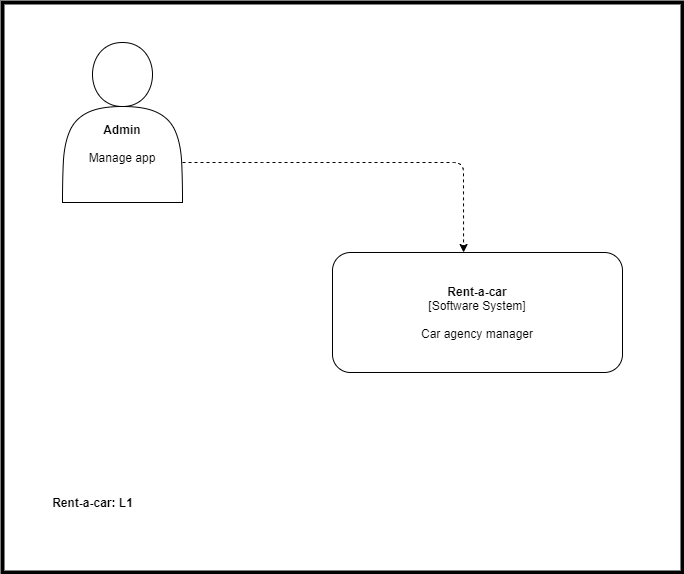
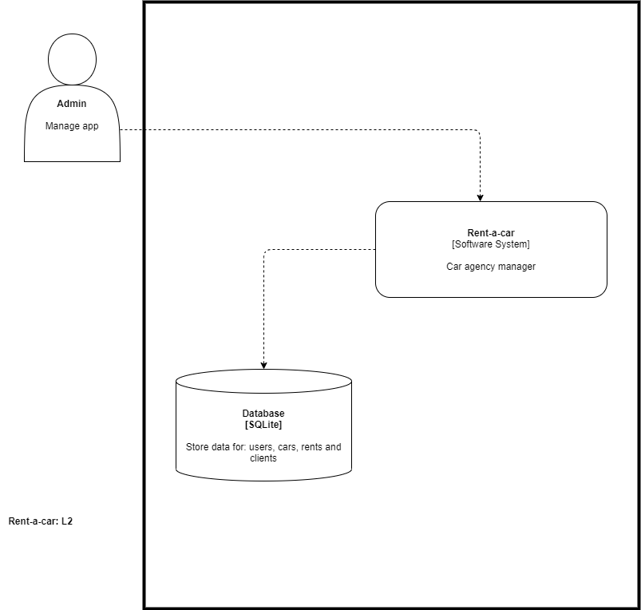
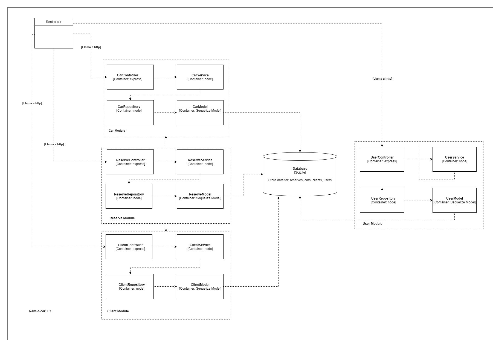

# rent-a-car
Web site for the management of a car rental agency.

Javascript, HTML, CSS, Node.js, SQLite, Sequelize, Nunjucks, Bulma and Passport

Unit testing with Jest

# How to install and run this project

Install with **"npm install"**

Once installed, you need to copy the .env.txt file, and paste it with .env only. Then you need to complete the value in DB_PATH=VALUE, this path needs to end with a .db file

The project runs with:

Script | Description
------------ | -------------
npm run dev | runs the project in dev mode
npm run schema:sync | sync the database with all the models
npm run test | runs jest tests and obtains the code coverage
npm run test:dev | runs jest tests in watch mode(continuously)

# Diagrams:

L1:

L2:

L3:

